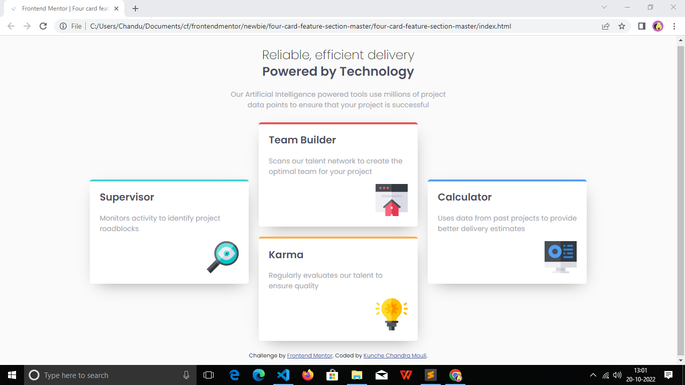
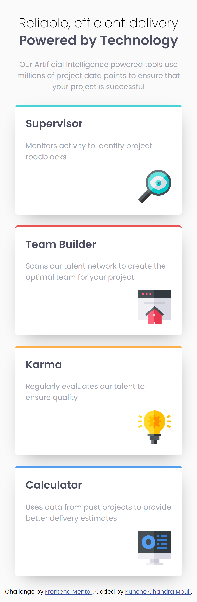

# Frontend Mentor - Four card feature section solution

This is a solution to the https://www.frontendmentor.io/challenges/four-card-feature-section-weK1eFYK. Frontend Mentor challenges help you improve your coding skills by building realistic projects. 

## Table of contents

- overview
  - the-challenge
  - screenshot
  - links
- my-process
  - built-with
  - what-i-learned
  - useful-resources
- author

## Overview

### The challenge

Users should be able to:

- View the optimal layout for the site depending on their device's screen size

### Screenshot

### Links

- Solution URL: https://github.com/chanduKunche/four-card-feature-section
- Live Site URL: https://chandukunche.github.io/four-card-feature-section/

## My process

### Built with

- Semantic HTML5 markup
- CSS custom properties
- Flexbox
- CSS Grid
- Mobile-first workflow

### What I learned

- how to design a four feature section using HTML and CSS.
- how to design using semantic HTML elements.
- how to use flexbox and grid CSS properties.
- how to build responsive webpages for big and small screens. 
- Learnt how to design interactive elements

### Useful resources

- https://www.w3schools.com/css/css3_flexbox_items.asp - This helped me to place and align the four sections in the page.

## Author

- Frontend Mentor - https://www.frontendmentor.io/profile/chanduKunche
